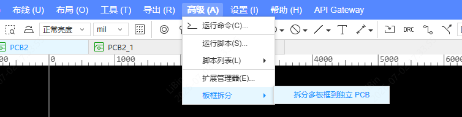
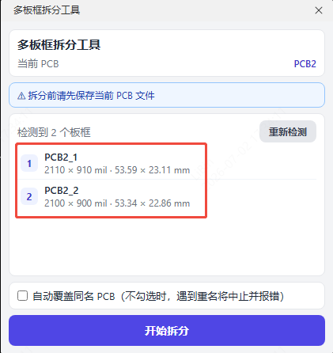
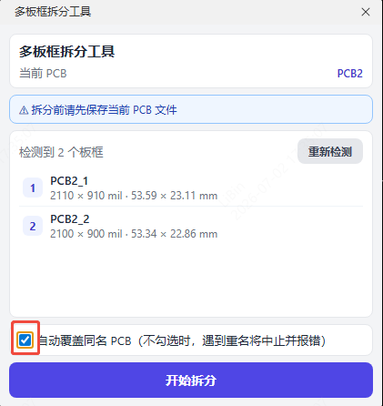
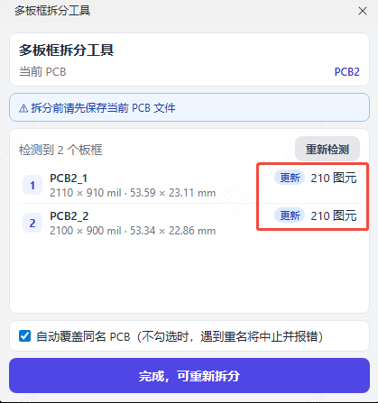
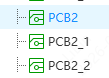

# Split the PCB by frame

> An EasyEDA Pro extension that identifies every independent board outline in a PCB and copies each outline along with all of its inner primitives into a separate, free-floating PCB file.

Ideal for panelized boards / stamp-hole panels, multiple boards sharing one PCB, or any case where you need to split a PCB into independent, manufacturing-ready files by outline. The source PCB is never modified; each split result is an independent free-floating PCB that can be sampled, exported, or edited on its own.

## Features

- **Auto-detects every independent board outline**
  - **Board Outline Regions** on the board outline layer (rectangle / circle / polygon / arc, drawn with the board outline tool);
  - **Top-layer Polyline / Arc graphics with no net** forming closed loops (hand-drawn fitted outlines): a single closed polyline becomes a loop directly, or multiple segments whose endpoints meet are stitched into a loop.
- **One board, one file**: each outline → its own free-floating PCB, named `<source PCB name>_1` / `_2` / ….
- **Cutouts follow**: Board Cutouts inside a board are assigned to that board and split out with it.
- **Design-rule sync**: the source PCB's design rules are copied to every target PCB by default (no toggle needed).
- **Shape-aware size**: the list shows ⌀ diameter for circles and bounding-box W×H for everything else (rectangle / rounded rectangle / polygon); each size is shown in both mil and mm.
- **Safety**: aborts with a warning when board outlines are nested or their contours intersect; the source PCB is never touched.
- **Bilingual**: menus and extension metadata follow the EDA client language automatically.

## Installation

1. Download `board-outline-splitter_vX.Y.Z.eext`.
2. EasyEDA Pro → top menu **Advanced → Extension Manager** → **Import** → choose the `.eext` file.
3. In "Installed", make sure the extension is enabled and tick "Show in top menu".
4. Open any PCB document; a **Board Split** menu appears.

## Usage

1. Open a PCB that contains multiple board outlines (**save first** recommended).
2. Top menu **Board Split → Split Board Outlines...**.
   
3. The popup auto-detects and lists every outline (index, target PCB name, size).
   
4. Tick **Auto-overwrite same-name PCB** if needed (see Options below).
   
5. Click **Start Split**; each board's status (Created / Updated / Failed) and kept-primitive count show inline on the right of each list row.
   
6. Find the generated PCBs in the document list afterwards.
   

## Options

### Auto-overwrite same-name PCB (unchecked by default)

- **Unchecked**: before splitting, all target PCB names are pre-checked. If any same-name free-floating PCB already exists (e.g. a previously split `xxx_1`), it **aborts immediately with an error** listing the conflicting names — no board is split. Delete the same-name PCB manually first, or tick this option and retry.
- **Checked**: a same-name free-floating PCB is auto-deleted and regenerated (i.e. "update" semantics).

> Design-rule sync is mandatory by default; there is no toggle for it.

## How It Works

1. **Outline detection**
   - Board Outline Regions on layer 11 (rectangle `R` / circle `CIRCLE` / polygon `L` / arc `ARC`);
   - Top-layer Polyline / Arc graphics with no net forming closed loops (a single closed polyline becomes a loop directly, or multiple segments whose endpoints meet are stitched);
   - Board Cutout Regions are treated as holes and assigned to the outline that contains them.
2. **Per-board split**: for each outline, fully clone the source PCB (`copyPcb`) → rename → on the clone keep only the primitives inside that outline (by representative-point ownership), delete the rest and the non-board outlines → sync design rules → save.
3. **Source protection**: the source PCB is never modified; if the clone's focus cannot be confirmed switched, that board is skipped rather than risk deleting from the source.

## Notes

- Save the source PCB before splitting.
- With "Auto-overwrite same-name PCB" unchecked, any same-name PCB aborts the whole split to avoid accidental overwrites.
- Primitives crossing a board boundary (tracks, copper pours) are assigned by representative point and may end up in only one board.

## Known Limitations

- Primitives crossing a board boundary are assigned by representative point and may end up in only one board.
- Primitives completely outside every board outline are deleted.
- Outlines containing arcs (ARC) are parsed via arc discretization; rotated rectangles (R command with rot) still need empirical calibration of their direction.
- Top-layer fitted outlines rely on "no net" to be distinguished from tracks; top-layer lines that carry a net are not recognized.

## Internationalization

Menus and extension metadata support Chinese / English and follow the EDA client language automatically.

## Development

```bash
# Install dependencies
npm install
```

```bash
# Build the extension package
npm run build
```

After building, a `.eext` package is generated under `./build/dist/`, which can be installed in EasyEDA Pro.

## License

Apache-2.0
