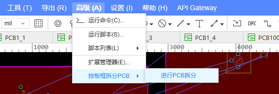

# 按板框拆分PCB

> 嘉立创EDA 专业版扩展：一键识别 PCB 内的多个独立板框，把每个板框及其内部全部图元分别复制到独立的游离 PCB 文件中。

适用于拼板 / 邮票孔拼板、多板共用一张 PCB、以及需要把整板按板框拆成独立可生产文件的场景。全程不修改源 PCB，拆分后每个板都是一份独立的游离 PCB，可直接单独打样、导出或继续编辑。

## 功能特性

- **自动识别全部独立板框**
  - 板框层的 **Board Outline Region**（矩形 / 圆形 / 多边形 / 圆弧，由板框工具绘制）；
  - 顶层的 **无网络 Polyline / Arc 线条**围成的闭合环：单条闭合折线直接成环，或多段端点相接拼成闭合环（手绘拟合板框）。
- **一板一文件**：每个板框 → 一个独立游离 PCB，命名 = 源 PCB 名 + `_1` / `_2` / …。
- **挖孔跟随**：单个板框内的 Board Cutout（挖孔）自动归到所属板框一并拆出。
- **设计规则同步**：自动把源 PCB 的设计规则复制到每个目标 PCB（默认行为，无需勾选）。
- **形状感知尺寸**：列表中圆形显示 ⌀直径，其余（矩形 / 圆角矩形 / 多边形）显示外接框 W×H；每种尺寸同时给出 mil 与 mm。
- **安全保护**：多板框相互嵌套或轮廓相交时告警中止；全程不动源 PCB。
- **中英双语**：菜单与扩展信息跟随 EDA 客户端语言自动切换。

## 安装

1. 下载 `board-outline-splitter_vX.Y.Z.eext`。
2. 嘉立创EDA 专业版 → 顶部菜单「**高级 → 扩展管理器**」→「**导入**」→ 选择该 `.eext` 文件。
3. 在「已安装」中确认该扩展已启用，并勾选「显示在顶部菜单」。
4. 打开任意 PCB 文档，顶部菜单出现「**按板框拆分PCB**」。

## 使用方法

1. 打开包含多个板框的 PCB（**建议先保存**）。
2. 顶部菜单「**按板框拆分PCB → 进行PCB拆分...**」。
   
3. 弹窗自动检测并列出全部板框（序号、目标 PCB 名、尺寸）。
   
4. 按需勾选「**自动覆盖同名 PCB**」（见下方选项说明）。
   
5. 点「**开始拆分**」，每板完成后的状态（新建 / 更新 / 失败）与保留图元数直接显示在列表项右侧。
   
6. 完成后在文档列表中查看生成的各个独立 PCB。
   

## 选项说明

### 自动覆盖同名 PCB（默认不勾选）

- **不勾选**：开始拆分前会预检所有目标 PCB 名。只要存在任一同名的游离 PCB（例如之前拆出的 `xxx_1`），**立即中止并报错**，列出冲突名称，不会拆分任何板。需要先手动删除同名 PCB，或勾选本项后再试。
- **勾选**：遇到同名游离 PCB 时自动先删除再重新生成（即「更新」语义）。

> 设计规则同步为默认必选行为，不再提供开关。

## 工作原理

1. **识别板框**
   - 板框层（layer 11）的 Board Outline Region（矩形 `R` / 圆形 `CIRCLE` / 多边形 `L` / 弧 `ARC`）；
   - 顶层无网络的 Polyline / Arc 线条围成的闭合环（单条闭合折线直接成环，或多段端点相接拼接）；
   - Board Cutout Region 作为挖孔，归到包含它的板框。
2. **逐板拆分**：对每个板框，整体克隆源 PCB（`copyPcb`）→ 改名 → 在克隆上只保留该板轮廓内的图元（按代表点归属判定），删除其余图元与非本板板框 → 同步设计规则 → 保存。
3. **源保护**：全程不动源 PCB；克隆焦点未确认切换时跳过该板，绝不误删源。

## 注意事项

- 拆分前请先保存源 PCB。
- 不勾选「自动覆盖同名 PCB」时，若存在同名 PCB 会整体中止，避免覆盖意外。
- 跨板框边界的图元（走线、覆铜）按代表点归属，可能只归入一个板。

## 已知局限

- 跨板框边界的图元按代表点归属，可能只归入其中一块板。
- 完全在所有板框之外的图元会被删除。
- 含圆弧（ARC）的板框已按弧离散解析；带旋转角度的矩形（R 命令 rot）板框方向仍待实测校准。
- 顶层线条板框靠「无网络」与走线区分；带网络的顶层线不会被识别。

## 国际化

菜单与扩展信息支持中文 / 英文，跟随 EDA 客户端语言自动切换。

## 开发

****

```bash
# 安装依赖
npm install
```

****

```bash
# 编译扩展包
npm run build
```

编译后在 `./build/dist/` 下生成 `.eext` 扩展包文件，可在嘉立创EDA专业版中安装。

## 开源许可

本扩展使用 Apache License 2.0 开源许可协议。
